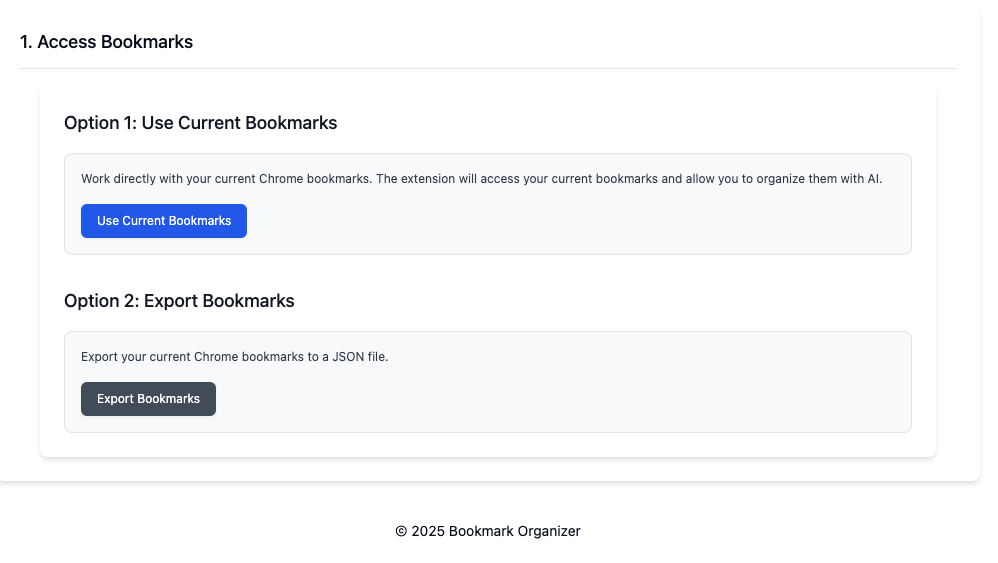

# Bookmarks Extension

A browser extension for efficient bookmark management. This extension helps you organize, search, and manage your bookmarks in a more intuitive and user-friendly interface.

## Disclaimer

**This extension is primarily a personal tool created for personal use.** It is shared as-is without any warranty or guarantee of any kind. The author is not responsible for any data loss, damage, or other issues that may arise from using this extension. Please use it at your own risk and make sure to back up your bookmarks before using this tool.

## Features

- Easily browse and search your existing bookmarks
- Organize bookmarks with custom tags and categories
- Fast and responsive interface built with React
- Modern UI using Tailwind CSS and shadcn components

## Installation

### From Store
*(Coming soon)*

### Manual Installation
1. Download the latest release from the [Releases](https://github.com/yourusername/bookmarks/releases) page
2. Unzip the file
3. In Chrome, go to `chrome://extensions/`
4. Enable "Developer mode" in the top right
5. Click "Load unpacked" and select the unzipped folder

## Development

### Prerequisites
- Node.js >= 18.0.0
- pnpm >= 8.0.0

### Setup
```bash
# Clone the repository
git clone https://github.com/yourusername/bookmarks.git
cd bookmarks

# Install dependencies
pnpm install

# Start development server
pnpm dev
```

### Build
```bash
# Build the extension
pnpm build

# The built extension will be in the dist/ directory
```

## Contributing

Contributions are welcome! Please see [CONTRIBUTING.md](CONTRIBUTING.md) for details.

## License

This project is licensed under the MIT License - see the [LICENSE](LICENSE) file for details.

## Screenshots
### Main

*Main page*
